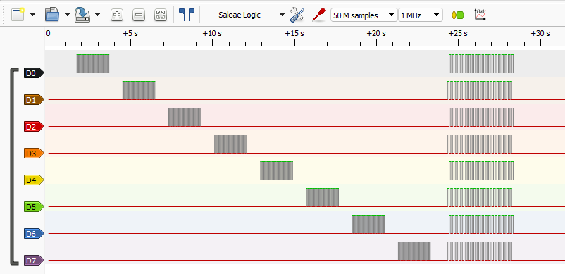

# Pico Logic Analyzer Test

Petit script MicroPython pour tester proprement le câblage entre une **Raspberry Pi Pico / Pico WH** et un **logic analyzer 24 MHz / 8 canaux**, avec visualisation dans **PulseView / Sigrok**.

L'idée est simple : avant de décoder des bus comme l'I2C, l'UART ou le SPI, le mieux d'abord est de vérifier que chaque fil de l'analyseur logique arrive bien sur la bonne broche de la Pico.

Le montage a été fait avec une **Freenove Breakout Board pour Raspberry Pi Pico 1 / 2 / W / H / WH**, ce qui rend les branchements beaucoup plus propres avec des câbles Dupont.

## Matériel utilisé

- Raspberry Pi Pico WH
- Freenove Breakout Board pour Raspberry Pi Pico
- Logic analyzer 24 MHz / 8 CH
- Câbles Dupont
- Thonny avec MicroPython
- PulseView / Sigrok

## Objectif du script

Le script active chaque GPIO l'un après l'autre avec une série d'impulsions.

Dans PulseView, on doit voir les canaux bouger dans l'ordre :

```text
D0, D1, D2, D3, D4, D5, D6, D7
```

Cela permet de confirmer que :

- la masse commune est bonne
- les canaux de l'analyseur logique sont bien reliés
- le mapping entre les fils, les GPIO et PulseView est clair
- le montage est prêt pour des tests I2C, UART et SPI

## Branchement utilisé

Sur mon analyseur logique, les broches sont nommées `CH1` à `CH8`, avec une broche `CLK` et une broche marquée `CND`.

Dans mon cas, `CND` correspond à la masse, donc à `GND`.

| Logic analyzer | PulseView | Raspberry Pi Pico | Rôle prévu |
| --- | --- | --- | --- |
| CND | GND | GND | Masse commune |
| CH1 | D0 | GP4 | I2C SDA |
| CH2 | D1 | GP5 | I2C SCL |
| CH3 | D2 | GP0 | UART0 TX |
| CH4 | D3 | GP1 | UART0 RX / signal de test |
| CH5 | D4 | GP16 | SPI0 RX / MISO / signal de test |
| CH6 | D5 | GP17 | SPI0 CSn |
| CH7 | D6 | GP18 | SPI0 SCK / Clock |
| CH8 | D7 | GP19 | SPI0 TX / MOSI |
| CLK | - | Non branché | Isolé / protégé |

## Point important sur la broche CLK

La broche `CLK` de l'analyseur logique n'est pas nécessaire pour ce test.

Même pour analyser du SPI, le signal clock du SPI doit être branché sur un canal normal de l'analyseur. Ici, j'utilise :

```text
CH7 / D6 -> GP18 / SPI0 SCK
```

La broche `CLK` est donc laissée non branchée, avec une protection pour éviter tout contact accidentel.

## Réglage conseillé dans PulseView

Pour bien voir tous les canaux, j'utilise :

```text
Sample rate : 1 MHz
Samples     : 50 M samples
```

Avec ce réglage, PulseView capture environ 50 secondes, ce qui laisse largement le temps de voir passer les tests de D0 à D7.

## Utilisation avec Thonny

1. Brancher la Pico au PC
2. Ouvrir Thonny
3. Vérifier que MicroPython est bien sélectionné pour la Pico
4. Ouvrir `pico_logic_analyzer_test.py`
5. Lancer la capture dans PulseView
6. Lancer le script dans Thonny
7. Observer les impulsions sur D0 à D7

## Résultat attendu

Chaque canal doit afficher une série d'impulsions, l'un après l'autre.

Exemple de correspondance dans PulseView :

```text
D0 = CH1 -> GP4
D1 = CH2 -> GP5
D2 = CH3 -> GP0
D3 = CH4 -> GP1
D4 = CH5 -> GP16
D5 = CH6 -> GP17
D6 = CH7 -> GP18
D7 = CH8 -> GP19
```

Si un canal ne bouge pas, il faut vérifier le câble correspondant, la broche utilisée sur la breakout board ou le canal activé dans PulseView.

## Capture

Une capture PulseView de test est disponible dans :

```text
captures/pulseview-test.png
```



## Note personnelle

Ce mini-projet me sert de base propre pour commencer à travailler avec un analyseur logique sur Raspberry Pi Pico. Avant de décoder des protocoles, je préfère valider le câblage. C'est simple, mais ça évite de chercher des bugs logiciels alors que le problème vient juste d'un fil mal placé.

## Licence

MIT
